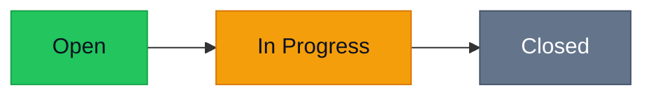
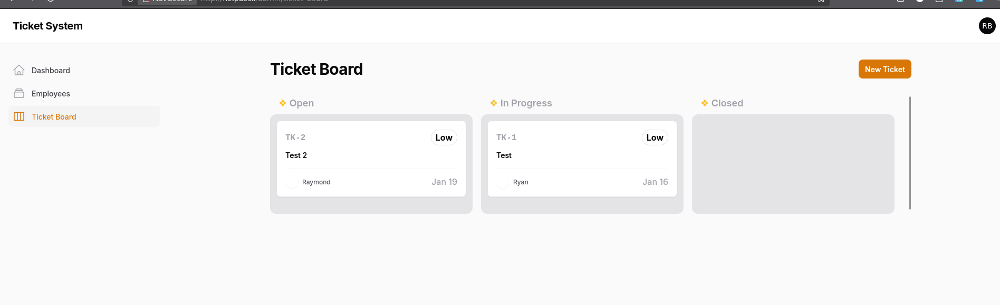

<h1 align="center">🎫 Helpdesk Ticket System</h1>

<p align="center">
  A Laravel + Filament helpdesk app for managing employees and support tickets with a Kanban workflow.
</p>

<p align="center">
  
  
  
  
  
</p>

---

## ✨ Highlights
- 🔐 User authentication
- 👥 Employee management
- 🎟️ Ticket management
- 🧩 Kanban board (Open → In Progress → Closed)
- 🧹 Clean Filament admin UI (fast CRUD + workflows)

---

## 🧭 Table of Contents
- [Features](#-features)
- [Tech Stack](#-tech-stack)
- [Requirements](#-requirements)
- [Getting Started](#-getting-started)
- [Filament Admin](#-filament-admin)
- [Ticket Workflow](#-ticket-workflow)
- [Configuration](#-configuration)
- [Deployment](#-deployment)
- [Troubleshooting](#-troubleshooting)
- [License](#-license)

---

## ✅ Features
### Core
- Authentication (login/logout)
- Employees CRUD
- Tickets CRUD
- Kanban board for ticket statuses

### Typical Ticket Fields (example)
- Title / Description
- Priority (Low/Medium/High)
- Status (Open/In Progress/Closed)
- Assigned To (employee/user)
- Created By (user)
- Timestamps and audit trail (if enabled)

---

## 🧰 Tech Stack
- Laravel
- Filament Admin Panel
- PHP / Composer
- Node.js / NPM (Vite)
- MySQL/MariaDB (or PostgreSQL)

> If you use a Kanban plugin/package, document it in the project (e.g. in `composer.json`) and mention it here.

---

## 📦 Requirements
- PHP 8.2+ (recommended)
- Composer
- Node.js + NPM
- Database: MySQL/MariaDB (or PostgreSQL)
- Web server: NGINX or Apache
- Git

---

## 🚀 Getting Started

### 1) Clone the repository
```bash
git clone git@github.com:ryanboc/helpdesk-ticket-system.git
cd helpdesk-ticket-system
```

### 2) Install dependencies
```bash
composer install
npm install
```

### 3) Setup environment
```bash
cp .env.example .env
php artisan key:generate
```

Update your `.env` (DB, APP_URL, etc). Example:
```env
APP_NAME="Helpdesk Ticket System"
APP_ENV=local
APP_DEBUG=true
APP_URL=http://helpdesk.test

DB_CONNECTION=mysql
DB_HOST=127.0.0.1
DB_PORT=3306
DB_DATABASE=helpdesk
DB_USERNAME=root
DB_PASSWORD=secret
```

### 4) Set folder permissions
```bash
sudo chown -R www-data:www-data storage bootstrap/cache
sudo chmod -R 775 storage bootstrap/cache
```

### 5) Migrate database
```bash
php artisan migrate
```

(Optional) Seeders (only if included):
```bash
php artisan db:seed
```

### 6) Build frontend assets
Development:
```bash
npm run dev
```

Production:
```bash
npm run build
```

---

## 🛠️ Filament Admin
Default Filament admin path is usually:
- `/admin`

Create an admin user (if needed):
```bash
php artisan make:filament-user
```

---

## 🗂️ Ticket Workflow

### Status flow
- **Open** → **In Progress** → **Closed**



> Tip: If you add more statuses (e.g. “Blocked”, “Waiting on User”), keep them consistent between the Kanban page and the database enum/column rules.

---

## ⚙️ Configuration

### Key environment variables
| Key | Purpose |
|---|---|
| `APP_URL` | Base URL (important for links/assets) |
| `DB_*` | Database connection |
| `MAIL_*` | Email notifications (optional) |
| `QUEUE_CONNECTION` | Background processing (optional) |

---

## 🌐 Deployment

> Replace paths, domain, and PHP-FPM version to match your environment.

### NGINX (recommended)
Create:
`/etc/nginx/sites-available/helpdesk-ticket-system`

```nginx
server {
    listen 80;
    server_name helpdesk.yourdomain.com;

    root /var/www/helpdesk-ticket-system/public;
    index index.php index.html;

    location / {
        try_files $uri $uri/ /index.php?$query_string;
    }

    location ~ \.php$ {
        include snippets/fastcgi-php.conf;
        fastcgi_pass unix:/run/php/php8.2-fpm.sock; # adjust version/path
        fastcgi_param SCRIPT_FILENAME $document_root$fastcgi_script_name;
        include fastcgi_params;
    }

    location ~ /\.ht {
        deny all;
    }

    client_max_body_size 20M;
}
```

Enable and reload:
```bash
sudo ln -s /etc/nginx/sites-available/helpdesk-ticket-system /etc/nginx/sites-enabled/
sudo nginx -t
sudo systemctl reload nginx
```

### Apache (with rewrite)
Create:
`/etc/apache2/sites-available/helpdesk-ticket-system.conf`

```apache
<VirtualHost *:80>
    ServerName helpdesk.yourdomain.com
    DocumentRoot /var/www/helpdesk-ticket-system/public

    <Directory /var/www/helpdesk-ticket-system/public>
        AllowOverride All
        Require all granted
    </Directory>

    ErrorLog ${APACHE_LOG_DIR}/helpdesk-ticket-system-error.log
    CustomLog ${APACHE_LOG_DIR}/helpdesk-ticket-system-access.log combined
</VirtualHost>
```

Enable and reload:
```bash
sudo a2enmod rewrite
sudo a2ensite helpdesk-ticket-system.conf
sudo apache2ctl configtest
sudo systemctl reload apache2
```

---

## 🧯 Troubleshooting

### Clear caches
```bash
php artisan optimize:clear
```

### Permission issues
```bash
sudo chown -R www-data:www-data storage bootstrap/cache
sudo chmod -R 775 storage bootstrap/cache
```

### Vite assets not loading
Dev:
```bash
npm run dev
```

Prod:
```bash
npm run build
```

---

## 📷 Screenshots



Then embed them here, for example:
```md

```

---

## 📄 License
Private / Internal project (update as needed).